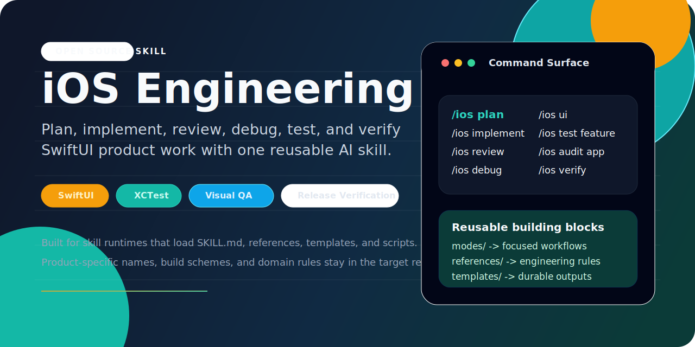
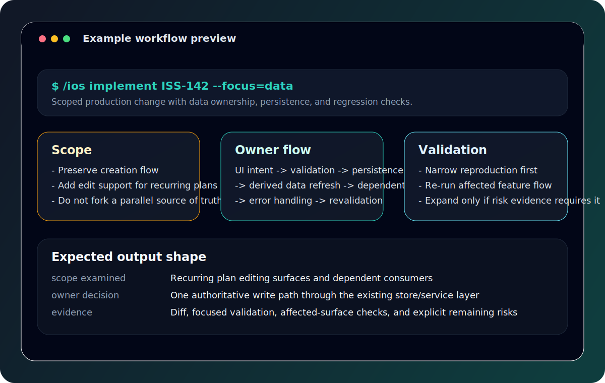
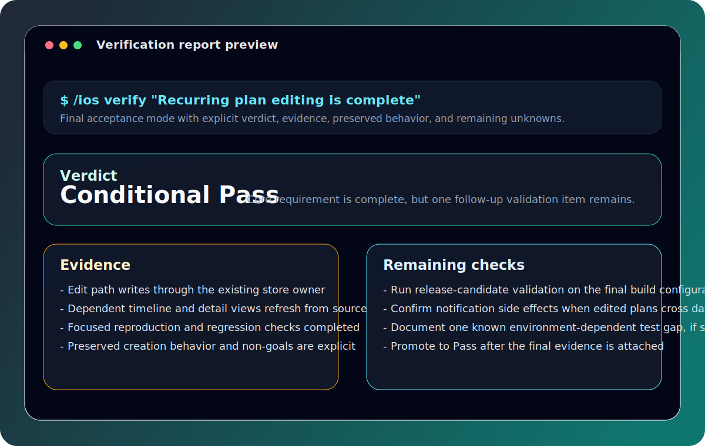

# ios-engineering

[](LICENSE)
[](https://github.com/greysonOuyang/ios-engineering-skill/releases)
[](https://github.com/greysonOuyang/ios-engineering-skill/commits/main)



Reusable open-source AI skill for the full lifecycle of an existing SwiftUI/iOS product: planning, implementation, review, debugging, UI validation, focused XCTest generation, whole-app audits, and evidence-based verification.

This repository is built for agent runtimes that load a `SKILL.md` entry point together with reusable references, templates, and helper scripts. The skill stays product-agnostic on purpose: project-specific module names, build schemes, domain rules, and validation commands belong in the target repository, not in the shared skill.

## Why this skill

- Use one reusable skill surface for product planning, implementation, review, debugging, testing, auditing, and release verification.
- Keep project facts separate from reusable engineering guidance, so the skill can move across teams and codebases cleanly.
- Route work into focused modes instead of mixing planning, debugging, review, and verification into one vague prompt.
- Preserve evidence, output structure, and validation expectations for higher-signal agent runs.

## Preview





## Command surface

| Command | Use it when |
| --- | --- |
| `/ios plan <requirement>` | Product structure, UX, data loop, execution grouping, or acceptance criteria are not frozen yet. |
| `/ios implement <task>` | You need a production change within a defined scope. |
| `/ios review <scope>` | You want a defect-focused engineering review of completed or partial work. |
| `/ios debug <failure>` | The observed behavior is wrong and the root cause is still unknown. |
| `/ios ui <replicate|review|fix> <surface>` | You need rendered UI replication, visual review, or visual defect repair. |
| `/ios test feature <feature>` | You want focused XCTest coverage for one feature or contract. |
| `/ios audit app` | You want staged whole-app QA or release-candidate validation. |
| `/ios verify <requirement>` | You need a final pass, conditional pass, or fail verdict with evidence. |

Detailed workflows live in `modes/`. Reusable engineering guidance lives in `references/`. Project-specific facts should stay in the target repository's profile, requirements, domain rules, design system, and testing instructions.

## Installation

Keep the repository intact after installation so relative links to `modes/`, `references/`, `templates/`, and `scripts/` continue to work.

### Codex runtime

```bash
git clone https://github.com/greysonOuyang/ios-engineering-skill.git \
  "${CODEX_HOME:-$HOME/.codex}/skills/ios-engineering"
```

### Claude-style runtime

```bash
git clone https://github.com/greysonOuyang/ios-engineering-skill.git \
  "$HOME/.claude/skills/ios-engineering"
```

If your setup uses another runtime folder such as `~/.agents/skills`, swap the destination path and keep the final directory name as `ios-engineering`.

### Source checkout plus symlink

```bash
git clone https://github.com/greysonOuyang/ios-engineering-skill.git \
  "$HOME/Projects/ios-engineering-skill"

ln -sfn "$HOME/Projects/ios-engineering-skill" \
  "${CODEX_HOME:-$HOME/.codex}/skills/ios-engineering"
```

### Update an installed copy

```bash
cd "${CODEX_HOME:-$HOME/.codex}/skills/ios-engineering"
git pull --ff-only
```

Restart your agent runtime if it caches available skills.

## Example prompts

```text
/ios plan "Add iPad-ready recurring schedule editing without changing existing creation behavior"
/ios implement ISS-142 --focus=data
/ios review current branch
/ios debug "After editing a recurring item, today's timeline becomes empty"
/ios ui review SettingsScreen
/ios test feature ReminderComposer
/ios audit app --scope=release-candidate
/ios verify "Recurring plan editing is complete"
```

Natural-language equivalents work too. If the user explicitly names a mode, the skill should route into that mode first.

## Repository layout

```text
ios-engineering/
├── SKILL.md
├── COMMANDS.md
├── modes/
├── references/
├── templates/
├── scripts/
├── agents/openai.yaml
├── metadata.json
└── assets/
```

- `SKILL.md`: entry point, routing, and operating rules
- `COMMANDS.md`: compact command reference for mode invocations
- `modes/`: focused workflows such as plan, implement, review, debug, test, audit, and verify
- `references/`: reusable engineering guidance loaded only when a task needs it
- `templates/`: durable report, prompt, and verification scaffolding
- `scripts/`: helper tooling for repeatable analysis
- `agents/openai.yaml`: UI metadata for OpenAI-compatible skill surfaces
- `metadata.json`: package metadata for distribution, indexing, and cataloging

## Project profile expectations

Start from `templates/project-profile.md` when a target repository does not already expose:

- product and domain truth locations
- module ownership
- state and persistence owners
- design-system names and component paths
- schemes, targets, and validation commands
- project-specific runtime invariants

## Compatibility and boundaries

- Designed for existing native iOS or SwiftUI applications, not greenfield web stacks.
- Expects a runtime that supports skill directories with a `SKILL.md` entry point.
- Keeps web-specific view-layer workflows, such as Tailwind or React refactors, outside this skill.
- Avoids hard-coding product names, token names, build targets, or domain models.

## Contributing

Issues and pull requests are welcome when they improve reusable iOS engineering workflows, references, templates, or helper scripts without baking in project-specific behavior.

## License

MIT
